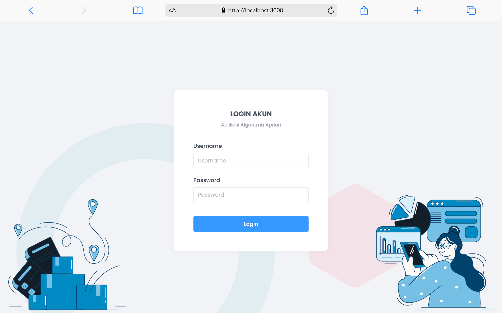
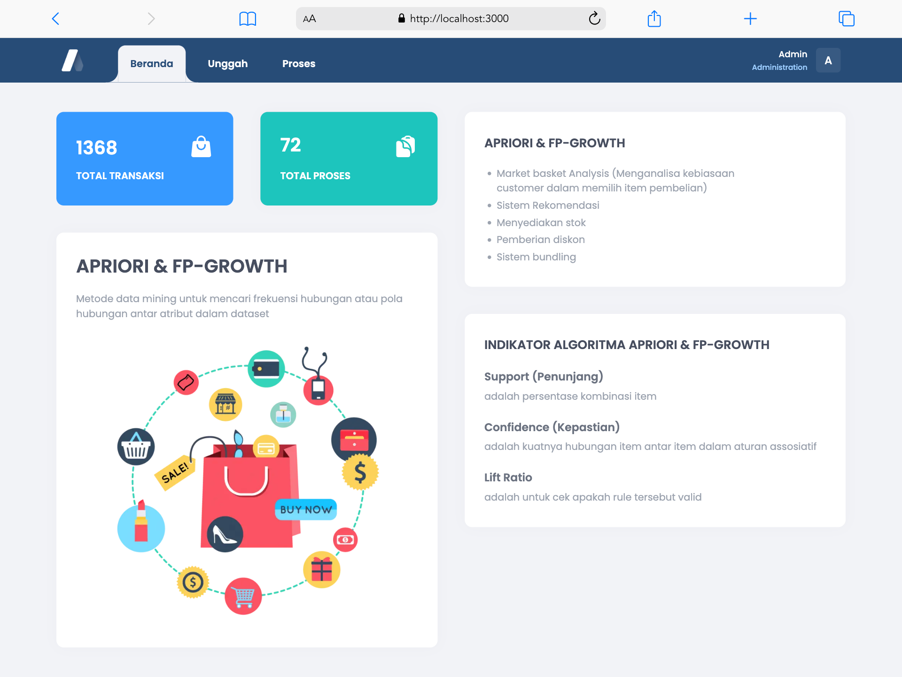
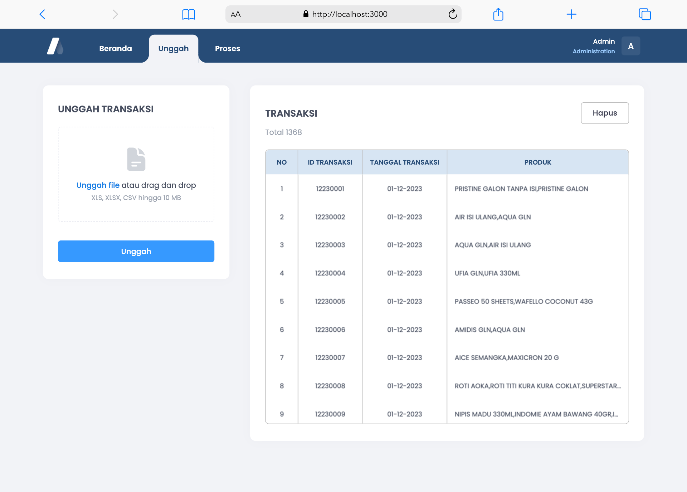
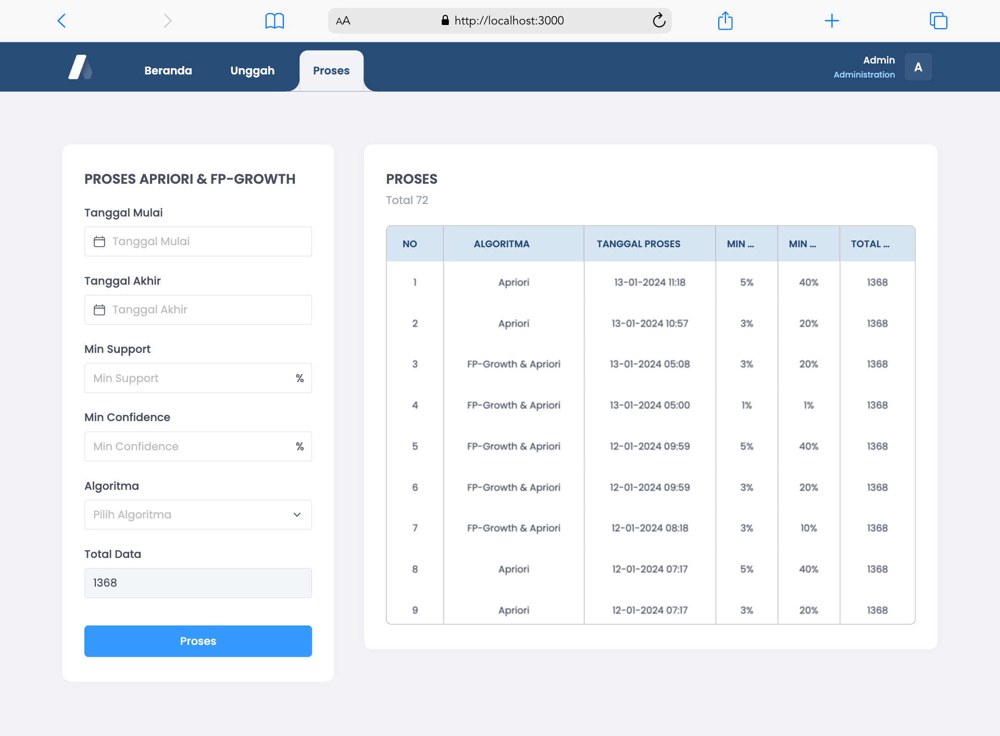
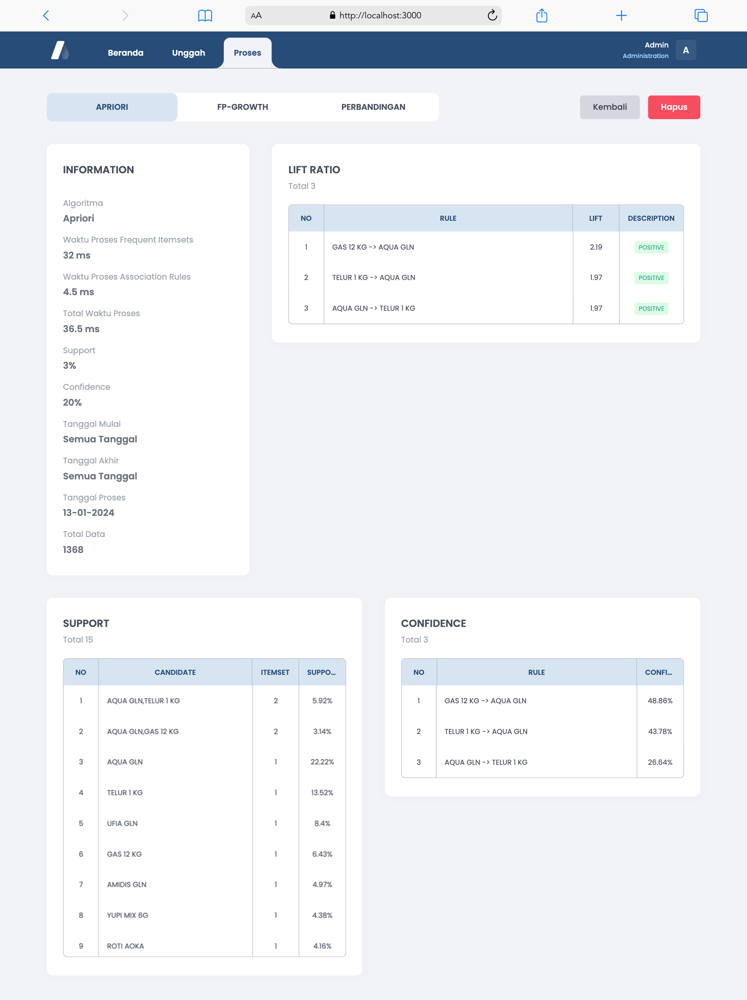
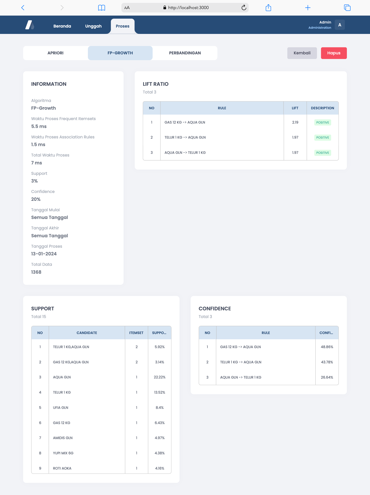
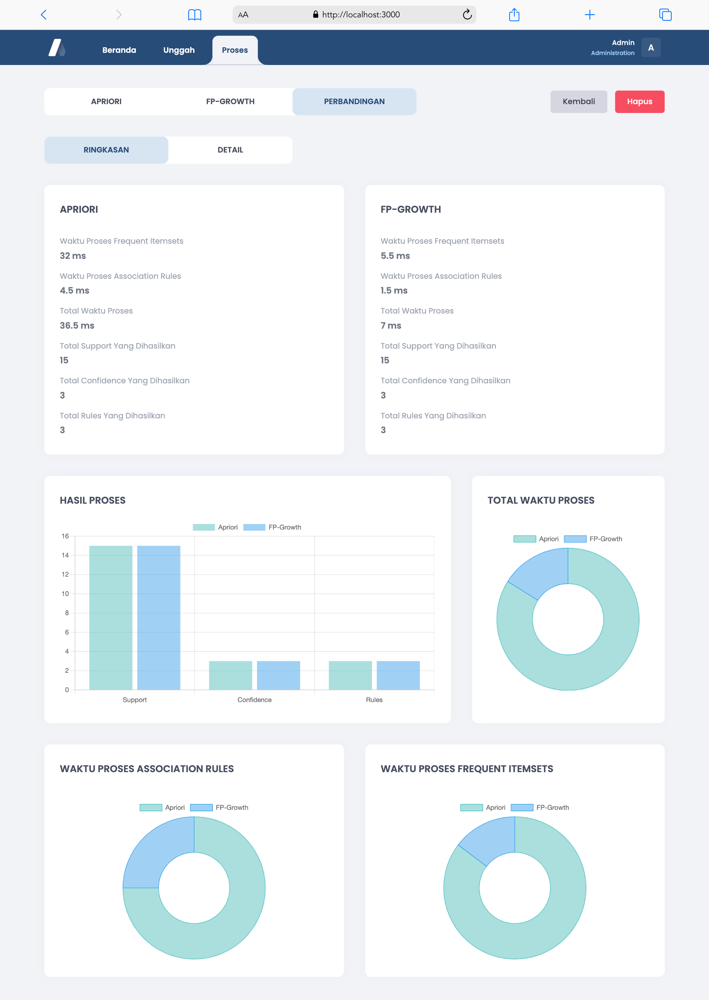
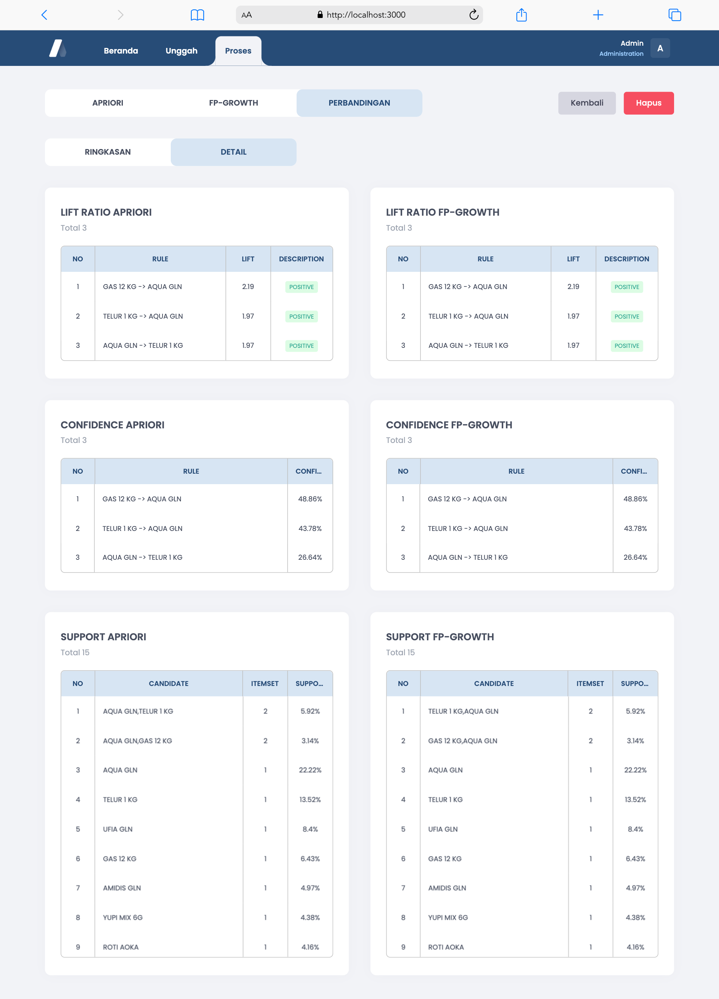

 

  <h1 align="center">Next.js Perbandingan Apriori & FP-Growth Web App</h1>
  

    Metode data mining untuk mencari frekuensi hubungan atau pola hubungan antar atribut dalam dataset
  

  
  
  

## Screenshots

<table>
  <tr>
    <td width="50%">Login</td>
    <td width="50%">Beranda</td>
  </tr>
  <tr>
    <td width="50%" style="padding: 0;">
      
    </td>
    <td width="50%" style="padding: 0;">
     
    </td>
  </tr>
  <tr>
    <td width="50%">Unggah</td>
    <td width="50%">Proses</td>
  </tr>
  <tr>
    <td width="50%" style="padding: 0;">
      
    </td>
    <td width="50%" style="padding: 0;">
     
    </td>
  </tr>
  <tr>
    <td width="50%">Detail Hasil Proses Apriori</td>
    <td width="50%">Detail Hasil Proses FP-Growth</td>
  </tr>
  <tr>
    <td width="50%" style="padding: 0;">
      
      
    </td>
  </tr>
  <tr>
    <td width="50%">Detail Perbandingan Ringkasan</td>
    <td width="50%">Detail Perbandingan Hasil Proses</td>
  </tr>
  <tr>
    <td width="50%" style="padding: 0;">
      
      
    </td>
  </tr>
</table>

## License

Licensed under the MIT License - see the [LICENSE](https://opensource.org/licenses/MIT) page for details.
